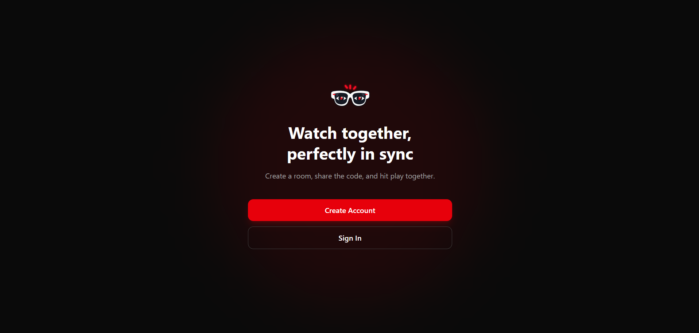

# YouTube Watch Party — Frontend

React + TypeScript frontend for a real-time synchronized YouTube watch party. Lets users sign up, create or join a room by code, and watch a YouTube video together with playback, roles, and permissions kept in sync live across everyone in the room.

Paired with a WebSocket + Express backend — see the backend repo for the server-side implementation and test evidence.

### **Live frontend:** https://youtube-watch-fe.vercel.app/
### **Live backend:** https://backend-youtube-watch.onrender.com
### **Backend repo :** https://github.com/Rumman963/Backend-Youtube-watch

---

## Tech Stack

| Layer | Technology |
|---|---|
| Framework | React + TypeScript (Vite) |
| Styling | Tailwind CSS |
| Routing | react-router-dom |
| HTTP client | axios |
| Real-time | native browser WebSocket |
| Video | YouTube IFrame Player API |

## Project Structure

```
src/
├── pages/
│   ├── HomePage.tsx       # Landing page
│   ├── signup.tsx         # Create account
│   ├── signin.tsx         # Sign in
│   ├── JoinRoom.tsx       # Create/join a room lobby
│   └── RoomDashboard.tsx  # Video + participants + host controls
├── icons/
│       └── WatchIcon.tsx
├── utils/
│   └── youtube.ts         # Extracts a video ID from a pasted YouTube URL
├── config.ts               # API_BASE_URL / WS_BASE_URL
├── socket.ts                # Shared WebSocket connection, survives page navigation
└── App.tsx                  # Router setup
```

---

## Screenshot Tour

Each screen below is paired with what it's actually demonstrating, not just what it looks like.

### Homepage
Landing page with the two entry points — create an account or sign in.


### Create Account
Signup form, wired to the backend's `POST /signup`. Shows inline error handling if the request fails.


<!-- Optional: if you have a screenshot of the duplicate-username error showing on this page, add it here the same way the backend README shows its rejection case -->

### Sign In
Signin form, wired to `POST /signin`. On success, the returned JWT is stored and the user is sent to the room lobby.


<!-- Optional: wrong-password error screenshot here -->

### Join a Watch Party
The logged-in lobby — create a brand new room, or join an existing one by code. Both paths go through the same WebSocket `join_room` event.


### Room Dashboard — as Host
The Host sees full playback controls and host-only actions (promote/demote, remove) next to every other participant.


### Room Dashboard — as Participant
The same room, viewed from a second account. Playback controls are disabled and a permission message is shown — proving the frontend actually reflects the backend's role-based permissions, not just hiding buttons cosmetically.


### Live Sync — Two Windows Side by Side
Two separate browser sessions in the same room, showing identical playback state, participant list, and roles updating in real time with no manual refresh.


### Host Controls in Action
The Host promotes a participant to Moderator / removes a participant — both windows update live from a single action.


### Responsive / Mobile View
The layout adapts to a narrow viewport.


---

## Architecture Notes

**Why `socket.ts` is a plain module, not a hook or component.** The WebSocket connection needs to survive navigating from `/join` to `/room/:roomId`. If it lived inside a component's state, it would close the moment that component unmounted. Keeping it as a module-level variable means any page can grab the same live connection with `getSocket()`.

**Permissions are enforced twice, on purpose.** The UI disables playback/host-action buttons based on the current user's role, so the interface never invites an action a user can't take. But the actual enforcement lives on the backend — every restricted event is re-checked server-side regardless of what the frontend shows. The frontend check is for UX; the backend check is what actually matters for security.

**Video sync flow.** Play/pause/change_video never touch the YouTube player directly from the button click. They only send the event over the socket. The backend broadcasts `sync_state` back to everyone — including the sender — and the player only ever updates from that one incoming message. This guarantees the person who clicked never drifts out of sync with everyone else.

## Known Limitations

- `seek` is supported by the backend but has no scrubber control wired up on the frontend yet — dragging the YouTube player's own timeline is not currently synced to other viewers.
- Room state is fully in-memory on the backend, so a backend restart clears all active rooms.

## Running Locally

```bash
npm install
npm run dev
```

Update `src/config.ts` to point at your backend:

```ts
export const API_BASE_URL = "http://localhost:3000";
export const WS_BASE_URL = "ws://localhost:3000";
```